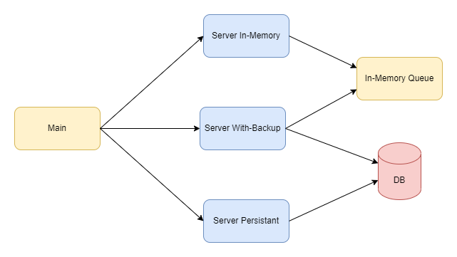
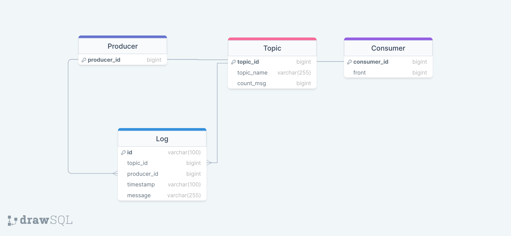

<h2>Distributed Queue</h2>

<h3>Group members:</h3>

<li>Abhilash Datta</li>
<li>Sunanda Mandal</li>
<li>Rohit Raj</li>
<li>Haasita Pinnepu</li>
<li>Matta Varun</li>
<li>Bhaskar</li>

<h3>System Specification</h3>
<li>OS: Ubuntu 22.04.1 LTS</li> 
<li>Python: 3.10.6<l/i> 
<li>Libraries: refer to <a href="https://github.com/DistributedSystemsGroup-IITKGP/Distributed-Queue/blob/main/requirements.txt"> requirements.txt </a> for details</li> 

<h3>How to run:</h3>
<ol>Clone the repository
	 
	<code>git clone https://github.com/DistributedSystemsGroup-IITKGP/Distributed-Queue.git</code></ol>
<ol>Setup Virtual Environment
	 
    <code>python -m venv .venv</code></ol>
<ol>Activate virtual env
	 
	<code>source .venv/bin/activate</code></ol>
<ol>Run Server
	 
	<code>python3 main.py</code></ol>
<ol>Test
	 
	<code>./test.sh</code></ol>
<ol>Run Unit Test
	 
	<li>Change the db.config to test on test database</li>
	<li>Run Command:<code>python3 -m unittest discover tests</code></li>
	<li>For individual modules run Command:<code>python3 -m unittest tests.{module_name}</code></li>
	</ol>

<h3>System Design</h3>
In this assignment we created three servers which are listed as follows:
<ol> Server_in_memory - This server only uses in memory queue and is not persistant</ol>
<ol> Server_persistent - This server only uses database to serve user requests and hence is slower compared to in-memory server</ol>
<ol> Server_backup - This server uses both in memory queue and database to keep backup. It has improved latency over server_persistent</ol>
 
This design is shown in below diagram:

The schema of used database is shown below:

